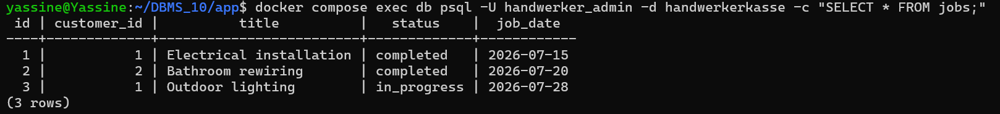
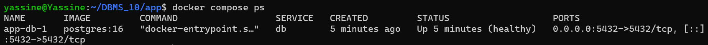
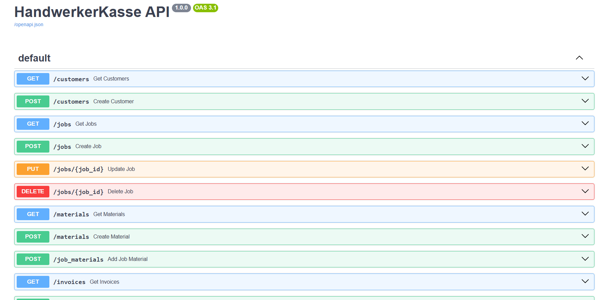
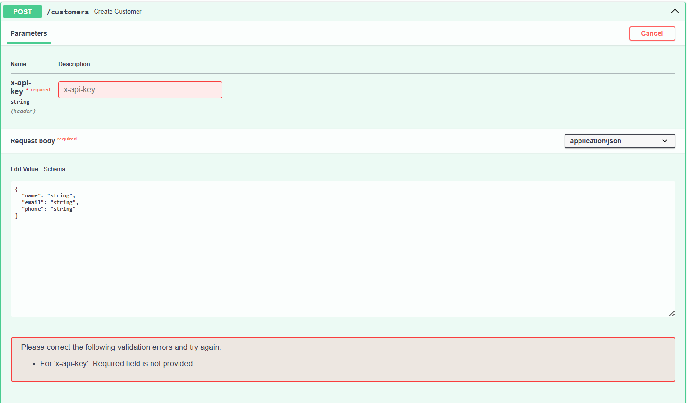
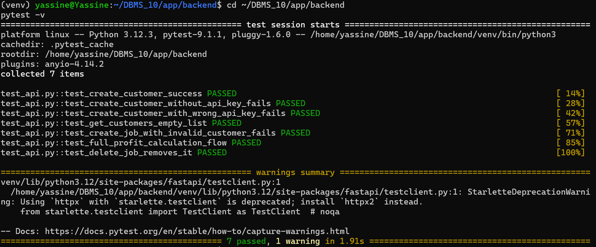
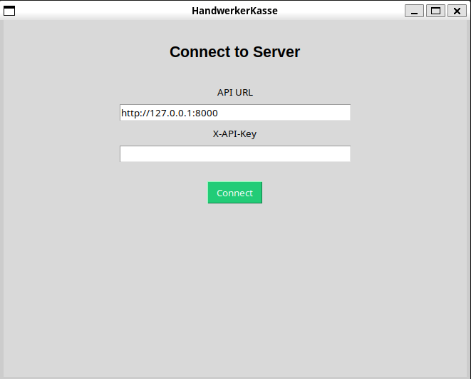
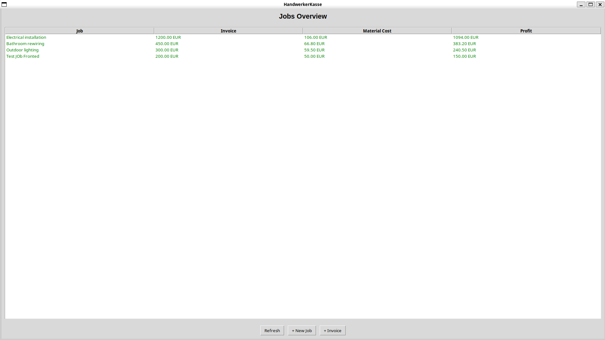
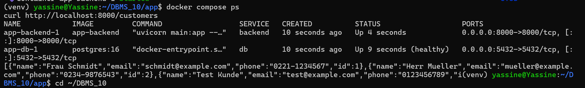
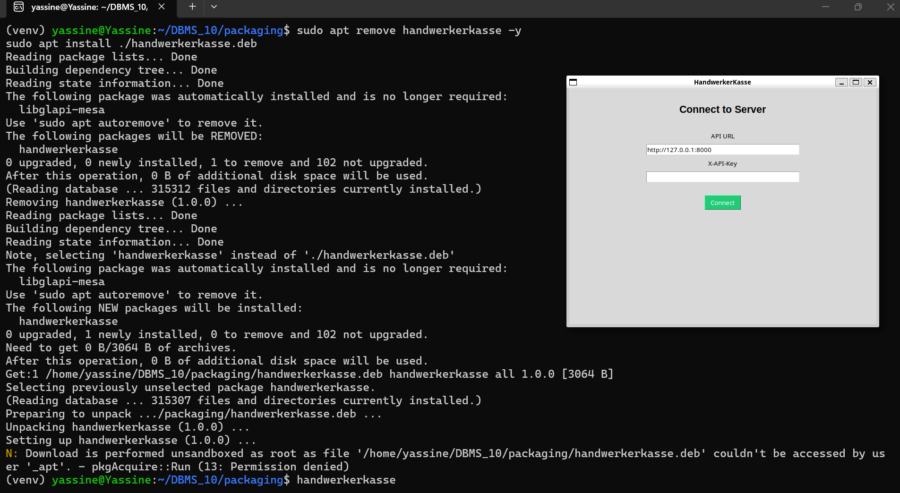

# HandwerkerKasse -- Material and Invoice Tracker with Profit Analysis per Job

**Module:** Introduction to Database Management Systems - THGA Bochum
**Author:** Mohamed Yassine Hachimi
**Lecturer:** Stephan Boekelmann - sboekelmann@ep1.rub.de

HandwerkerKasse is a database-driven application for small craft businesses.
It lets users manage customers, jobs, materials and invoices, and automatically
calculates the profit of each job by comparing the invoice amount against the
material costs used.

## Documentation

- Project Proposal: proposal-template/proposal.tex
- User Guide: user-documentation/documentation.pdf
- Developer Documentation: developer-documentation/documentation.pdf

## Architecture

Frontend (Tkinter, installed as .deb) -- HTTP + X-API-Key --> FastAPI --> PostgreSQL

Backend and database run via Docker Compose.

- Database: PostgreSQL, 5 tables (customers, jobs, materials, job_materials, invoices), normalized to 3NF.
- Backend: FastAPI with SQLAlchemy, 12 REST endpoints, write operations protected with an X-API-Key header.
- Frontend: Tkinter desktop application, packaged as a Debian (.deb) installer.
- Deployment: Backend and database run as containers via Docker Compose.

## Repository layout
```
app/
  docker-compose.yml
  .env
  db/
    schema.sql
    seed.sql
  backend/
    main.py
    models.py
    schemas.py
    database.py
    test_api.py
    conftest.py
    Dockerfile
  frontend/
    main.py

packaging/
  handwerkerkasse/
  handwerkerkasse.deb

proposal-template/
user-documentation/
developer-documentation/
style/thga-db.sty
docs-screenshots/
```
## Running the system

Requirements: Docker, Docker Compose.
```
cd app
docker compose up -d --build
```

This starts PostgreSQL (seeded with sample data) and the FastAPI backend at
http://localhost:8000. Interactive API docs are available at
http://localhost:8000/docs
 

## Running the frontend

```
sudo apt install ./packaging/handwerkerkasse.deb
handwerkerkasse
```

Or run it directly without installing:

```
cd app/frontend
python3 main.py
```

## Running the tests

```
cd app/backend
python3 -m venv venv
source venv/bin/activate
pip install -r requirements.txt
pytest -v
```

## Building the documentation PDFs

Requirement: latexmk and TeX Live (apt install latexmk texlive-full).

```
cd user-documentation && make
cd ../developer-documentation && make
```

## Development Process

This section documents the step-by-step process used to build the system, in the order it was actually developed.

### Step 1 -- Database setup with Docker Compose

The PostgreSQL database was started as a container with the schema and seed data loaded automatically on first start.

```bash
cd app
docker compose up -d
```

**Verification:** querying the seeded data directly via `psql`.



**Verification:** the database container running in a healthy state.



### Step 2 -- FastAPI backend with SQLAlchemy

The backend was built with FastAPI and SQLAlchemy, exposing CRUD endpoints for all five tables plus the profit calculation endpoint.

```bash
cd app/backend
uvicorn main:app --reload
```

**Verification:** the automatically generated Swagger UI listing all endpoints.



**Verification:** `GET /customers` returning seeded data.


**Verification:** `GET /jobs/profit` returning the calculated profit per job (the core feature of the system).


### Step 3 -- API key authentication

Write endpoints were protected with an `X-API-Key` header.

**Verification:** a write request without a valid key is rejected with 401.



**Verification:** the same request succeeding with a valid key.


### Step 4 -- Automated testing with pytest

An automated test suite was written covering the acceptance criteria: authentication, invalid foreign keys, and the full profit calculation flow, run against an isolated test database.

```bash
cd app/backend
pytest -v
```

**Verification:** all tests passing.



### Step 5 -- Tkinter desktop frontend

A four-screen desktop client was built with Tkinter: connect, jobs overview, job/material form, and invoice form.

```bash
cd app/frontend
python3 main.py
```

**Verification:** connection screen and jobs overview populated with live data.




### Step 6 -- Backend containerized with Docker Compose

The backend was moved from running manually with `uvicorn` to running as a container alongside the database, connected via the Docker Compose network.

```bash
docker compose up -d --build
```

**Verification:** both containers running together.



### Step 7 -- Packaging the frontend as a .deb installer

The frontend was packaged as a Debian package so it can be installed like any other application.

```bash
cd packaging
dpkg-deb --build --root-owner-group handwerkerkasse
sudo apt install ./handwerkerkasse.deb
```

**Verification:** the installed application running.


